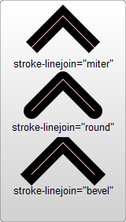

> [SVG MDN](https://developer.mozilla.org/zh-CN/docs/Web/SVG/Tutorial)

### SVG
svg虽是html5的范畴, 但js同样可以对其进行操作.


#### svg矢量图画布
属性|值类型|说明
-|-|-
width|int|画布宽度
height|int|画布高度
viewBox|str|内容显示。<br>此例中将显示宽高各为100的内容，画布为200，等同于放大了2倍显示。
```html
<svg
  width="200"
  height="200"
  viewBox="0 0 100 100"
></svg>
```

#### rect, circle, ellipse, line, polyline, polygon, path
```html
<svg>
  <rect
    x=10 y=10
    rx=0 ry=0
    width=40 height=30
    stroke-width="2" stroke="#000" fill="transparent" />
  <circle
    cx=25 cy=75  r=10
    stroke-width="2" stroke="#0f0" fill="transparent" />
  <ellipse
    cx=75 cy=75
    rx=20 ry=5
    stroke-width="2" stroke="#00f" fill="transparent" />
  <line
    x1=10 y1=60
    x2=90 y1=60
    stroke-width="2" stroke="#00f" fill="transparent" />
  <polyline points="60 110 65 120 70 115 75 130 80 125 85 140 90 135 95 150 100 145"
    stroke-width="2" stroke="#00f" fill="transparent" />
  <polygon points="50 160 55 180 70 180 60 190 65 205 50 195 35 205 40 190 30 180 45 180"
    stroke-width="2" stroke="#00f" fill="transparent" />
  <path d="20,230 Q40,205 50,230 T90,230"
    stroke-width="2" stroke="#00f" fill="transparent" />
</svg>
```
##### rect(矩形)
属性|说明
-|-
x|矩形左上角的x位置
y|矩形左上角的y位置
width|矩形的宽度
height|矩形的高度
rx|圆角的x方位的半径
ry|圆角的y方位的半径
##### circle(圆形)
属性|说明
-|-
r|圆的半径
cx|圆心的x位置
cy|圆心的y位置
##### ellipse(椭圆)
属性|说明
-|-
rx|椭圆的x半径
ry|椭圆的y半径
cx|椭圆中心的x位置
cy|椭圆中心的y位置
##### line(线条)
属性|说明
-|-
x1|起点的x位置
y1|起点的y位置
x2|终点的x位置
y2|终点的y位置
##### polyline(折线), polygon(多边形)
属性|说明
-|-
points|点集合, 用空白( )/逗号(,)/终止符(;)/换行符(\n)
##### path(路径)
d格式|示例|说明
-|-|-
M x y|M 10 10|画笔移动到(10,10)坐标
m dx dy|m 10 10|画笔向右偏移10,向下偏移10
L x y|L 20 10|画线到(20,10)坐标
l dx dy|l 10 0|画线,向右10,向下0
H x|H 20|横线划到x坐标20
h dx|h 10|横线向右画10
V y|V 10|竖线划到y坐标10
v dy|v 10|竖线向下画10
Z或z|z|从最后一个点画到move的起点,路径闭合.
C x1 y1 x2 y2 x y| |贝塞尔曲线. 起点控制点,终点控制点,终点
c dx1 dy1 dx2 dy2 dx dy| |贝塞尔曲线. 起点控制偏移点,终点控制偏移点,终点偏移点
S x2 y2 x y||对称控制点,终点
s dx2 dy2 dx dy||对称控制偏移点,终点偏移
Q x1 y1 x y||起点与终点的控制点,终点
q dx1 dy1 dx dy||起点与终点的控制点偏移,终点偏移
T x y||镜像上一个控制点的终点(前面必须有Qq或Tt)
t dx dy||镜像上一个控制点的终点偏移(前面Qq或Tt)
A rx ry rotation large sweep x y||椭圆的x半径,y半径,旋转度数,large弧度比180度小0/大1,sweep起终逆时针0/顺时针1.
a rx ry rotation large sweep dx dy||

##### stroke 线条模式


<br>
`fill-rule`, `stroke-miterlimit`, `stroke-dashoffset`
> \<rect style="stroke:black; fill:red" /\> 可以接收的style属性

##### \<defs\>中的内容可以不被\<svg\>显示.
- \<style\>标签<br>
- \<linearGradient\>节点<br>
```html
<svg width="120" height="240" version="1.1" xmlns="http://www.w3.org/2000/svg">
  <defs>
      <linearGradient id="Gradient1">
        <stop class="stop1" offset="0%"/>
        <stop class="stop2" offset="50%"/>
        <stop class="stop3" offset="100%"/>
      </linearGradient>
      <linearGradient id="Gradient2" x1="0" x2="0" y1="0" y2="1">
        <stop offset="0%" stop-color="red"/>
        <stop offset="50%" stop-color="black" stop-opacity="0"/>
        <stop offset="100%" stop-color="blue"/>
      </linearGradient>
      <radialGradient id="Gradient"
            cx="0.5" cy="0.5" r="0.5" fx="0.25" fy="0.25">
        <stop offset="0%" stop-color="red"/>
        <stop offset="100%" stop-color="blue"/>
      </radialGradient>
      <style type="text/css"><![CDATA[
        #rect1 { fill: url(#Gradient1); }
        .stop1 { stop-color: red; }
        .stop2 { stop-color: black; stop-opacity: 0; }
        .stop3 { stop-color: blue; }
      ]]></style>
  </defs>
  
   <rect id="rect1" x="10" y="10" rx="15" ry="15" width="100" height="100"/>
   <rect x="10" y="120" rx="15" ry="15" width="100" height="100" fill="url(#Gradient2)"/>

  <rect x="10" y="10" rx="15" ry="15" width="100" height="100"
        fill="url(#Gradient)" stroke="black" stroke-width="2"/>
  <circle cx="60" cy="60" r="50" fill="transparent" stroke="white" stroke-width="2"/>
  <circle cx="35" cy="35" r="2" fill="white" stroke="white"/>
  <circle cx="60" cy="60" r="2" fill="white" stroke="white"/>
  <text x="38" y="40" fill="white" font-family="sans-serif" font-size="10pt">(fx,fy)</text>
  <text x="63" y="63" fill="white" font-family="sans-serif" font-size="10pt">(cx,cy)</text>
</svg>
```
[圆形渐变](radial-grandient.png) 

#####
